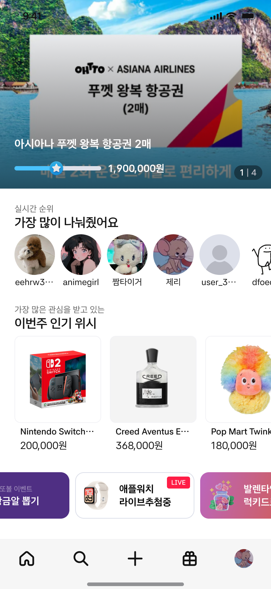
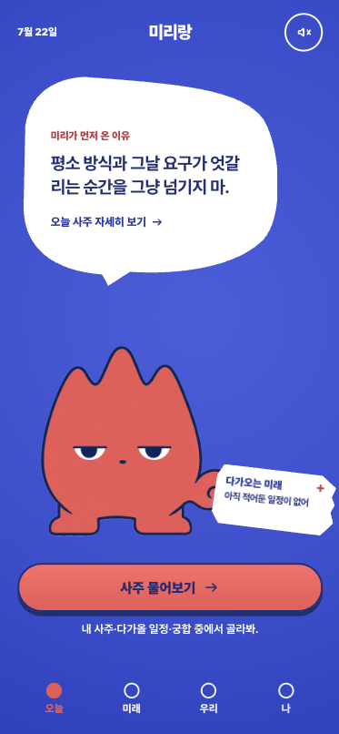

# Sunwoo Kim (김선우)

**Fullstack engineer & CTO. 12 years. I ship products — and I keep them running.**

Building fast is table stakes now. Anyone can generate a screen.
What I do is design the thing behind the screen so it doesn't fall over — and then actually operate it.

- 🏗️ CTO @ YAYLABS · Co-founder @ YayPlanet — built **Oildealer solo**: escrow-backed B2B reverse-auction platform, **3 client apps (customer web+mobile, vendor, admin), live on both app stores**, 5 microservices on Kubernetes
- 🤖 **I run my company AI-native.** An in-house AI agent (**Hermes**) lives in Slack: it auto-tags documents into Notion, routes planning tickets to developers, and closes the loop — deploy done → report back → ticket closed → patch notes generated. **Slack is the whole company's single gateway.** Now delivering the same **AX (AI transformation) pipelines for external clients — a hospital and an investment firm**.
- 🎨 I build without designers. Not "AI-looking" UI — I wrote a design system that teaches AI design *judgment*, and open-sourced it: **[styleseed](https://github.com/bitjaru/styleseed)**  — **800+ organic stars, zero marketing, still climbing**
- 📊 ML in production, not in notebooks — LSTM price model at 0.74% MAPE, beat GARCH/VAR/XGBoost
- ⛓️ Web3 at scale — RWA bond protocol · transaction forwarding API for 300K game users at 100+ TPS · Unity WebGL game shipped inside **both Telegram and LINE mini-apps**
- 🏢 Before this: eBay Korea (led legacy → React SPA migration), Samsung Card (Vue/Nuxt architecture)

---

## Portfolio at a glance

| | |
|---|---|
|  |  |
|  |  |
|  |  |

---

## What I actually do

|  |  |
| -------------------------------- | --------------------------------------------------------------------------------------------------------------------------------------------------------------- |
| **Depth, not just breadth**      | Led a legacy (JSP/jQuery/.NET) → React SPA migration on a live commerce platform. Page load −60%, DB load −40%. Nothing broke.                                   |
| **0→1 with architecture**        | Took a product from "we have an idea" to shipped MVP as a contractor — auth, payments, points, raffle engine, community, admin.                                  |
| **AI-native operations**         | Built the company's internal AI infra myself: a Slack-resident agent (Hermes) that tags & archives docs to Notion, generates status reports, and runs the ticket → dev → deploy → patch-note pipeline. Every employee works through Slack as the gateway. Now replicating this for client orgs (hospital · investment firm). |
| **Design without a designer**    | [styleseed](https://github.com/bitjaru/styleseed) — 74 design rules, 48 components, 7 brand skins. The tool I built to fix the UI that AI coding tools generate. |
| **Infra that stays up**          | Kubernetes, zero-downtime deploys, CI/CD, Saga-pattern event-driven orchestration. Running today, not a demo.                                                    |
| **AI as a pipeline, not a demo** | Agent workflows that scan → analyze → render → package, with a human gate before publish.                                                                        |

---

## Selected work

### Oildealer — escrow-backed B2B reverse-auction platform (built solo, live on both stores)

CTO. Planning → architecture → development → design → operations. **One person, end to end.**

Everything a production service needs, in one project: **reverse auction · escrow payments · community · ML price forecasting · monitoring · web ordering · customer app · vendor app · admin**. **3 client apps built solo** — customer (web-only + app-only), vendor, admin — **shipped to both iOS/Android stores** and operated since (review cycles, rejections, version rollouts included).
5 microservices (dual frontend / collection API / business backend / scheduler / admin) on Kubernetes, zero-downtime.
MongoDB Time Series + Redis. Playwright-based market data pipeline. GPT-4o news agent with daily briefing.
In-house LSTM price forecasting — **MAPE 0.74%, 88% directional accuracy**, benchmarked against GARCH · VAR · VECM · XGBoost.
Windows agent syncing POS + tank sensors on site. **Zero designers on the project.**
Corporate site included: **[oildealer.co.kr](https://oildealer.co.kr)** — blog-connected, all visual assets generated through an AI pipeline (Higgsfield).

### Hermes — AI-native company infrastructure (in production, daily)

Slack is the company's operating system — not a metaphor, the actual daily workflow:
a planner posts a request and the agent acknowledges it **in-thread** · documents get auto-tagged and archived into Notion · dev progress is reported at the level of **ticket numbers, branch names and commit hashes** ("verified in code", not "probably done") · the AI dev-session bot posts `[in-progress]` updates (PR merged → deploying → tests passing) and closes with `[done]` — production live, **patch notes auto-generated back to the planner** · missing artifacts (deploy URL, QA results) are chased by the agent, not by humans.
Channels are designed on purpose: planning↔dev handoff · product specs · ops · alert severity tiers · **a dedicated channel per AX client**. Humans keep the decisions; the agent keeps the state.
Now shipping the same loop externally as **AX (AI transformation) for two clients**: a **hospital** — marketing-intelligence pipeline on official Naver/YouTube APIs (keyword · ad-creative · content-trend collection with medical-ad compliance guardrails) plus an **AI-citation back-tracking loop** (trace which sources AI assistants cite → find gaps where competitors are cited and you aren't → prescribe content → re-measure) — and an **investment firm** (internal operations AX).

### YieldCore — on-chain RWA bond investment protocol

Solidity contracts (proxy & non-proxy variants) where investors deposit USDC against real-world bond deals — deposit/withdraw hub, deal vaults, loan registry, P2P share marketplace. 24h timelock on loan execution, multisig, role separation.
Next.js investor dashboard (TVL/APY, deals, portfolio) and a Node.js monitor watching on-chain events 24/7 with Slack alerts — fund movements, pause events, payout reminders.
Corporate site: **[yieldcorelabs.com](https://yieldcorelabs.com)** — English-first, Notion-backed content pipeline (non-devs edit in Notion, the site updates itself).

### FANANAS — Unity WebGL game on Telegram & LINE mini-apps

Solitaire-based Web3 game: Unity (C#) → WebGL build, shipped inside **both Telegram and LINE mini-apps**.
Kotlin middleware bridging game score ↔ platform identity ↔ on-chain settlement. Running on Kubernetes.
Mission & reward logic is a specialty: completion judgment → reward grant → conditional unlock, with probability tables externalized from code.

### NNN — Telegram × TON gamefi launchpad

Launchpad backend (Node/Express, layered), TON smart contracts, Telegram mini-app frontend, partner-game integration API.
Probability-driven mystery box engine with externalized probability tables. Weekly reward distribution via cron, with recovery path on failed payouts.
Partner games integrated in under a day.

### Transaction forwarding API — LINE × Kaia

Redis + message queue architecture that decouples transaction submission from service logic.
Sidesteps nonce collisions and rate limits by queueing instead of hammering the chain. Retries, backoff, failure replay. **300K game users. 100+ TPS at peak.**

### Penguinboard — multi-platform seller data SaaS

B2B SaaS unifying seller data across 9 commerce platforms — with a **Chrome Extension (MV3) collection engine**: XHR/Fetch interceptors, session keep-alive, verified live against real seller admin consoles.

### OHTTO — wish-based social commerce (contracted MVP, delivered)

Took it on with no plans and no designs; delivered a working MVP end to end as a contractor — Kakao login, PG payments, points, live raffle engine, community, admin. The wish-ranking home above is the shipped product.

### MARKET WHY — AI narration video pipeline

Script → TTS (SSML-controlled) → **scene timing auto-matched to the actual audio length** → subtitles → thumbnail → publish package.
The sync isn't eyeballed on a timeline; the voice length determines the scene length. Change the script, re-render, still in sync.
Runs headless on a schedule. Publishing stays a human decision.

### Mirirang — AI-character-first fortune app

A fortune-telling app where the AI character speaks first — planning, character design direction, and development in one hand.

---

## Open source

**[styleseed](https://github.com/bitjaru/styleseed)**  — *Teach your AI design judgment. Not just components.* Design system engine for Claude Code / Codex / Cursor. 74 rules, 48 components, 7 brand skins (Toss/Stripe/Linear/Notion/Raycast/Arc/Vercel), a named motion system. **800+ stars, all organic — no launch post, no ads.** MIT.

**[codesyncer](https://github.com/bitjaru/codesyncer)** — *Claude forgets everything when the session ends. CodeSyncer makes it remember.* Multi-repo collaboration framework for AI coding agents. Decisions and inferences get recorded as `@codesyncer-*` tags instead of evaporating. On npm. Oildealer actually runs on it.

**[pixelmind](https://github.com/bitjaru/pixelmind)** — *Your LLM is blind to what it creates. We give it eyes.* Render-aware feedback loop for LLM-generated UI.

---

## Experience

|                   |                             |                                                                  |
| ----------------- | --------------------------- | ---------------------------------------------------------------- |
| 2025.12 –         | **YayPlanet**               | Co-Founder                                                       |
| 2022.05 –         | **YAYLABS**                 | **CTO & Co-Founder**                                             |
| 2021.12 – 2022.05 | **Samsung Card**            | Frontend (CL3) — Vue/Nuxt architecture for a new service         |
| 2017.07 – 2021.11 | **eBay Korea**              | Software Engineer — Smile Club. Led legacy → React SPA migration |
| 2014.01 – 2017.02 | Research (military service) | Intrusion-tolerant systems, Xen hypervisor-based detection       |

**M.S. Computer Science**, Hanyang University — Computer Network Security Lab

---

## Stack

**Frontend** React · TypeScript · Next.js · Vite · Capacitor · Tailwind **Backend** Node.js · Express · NestJS · Python · FastAPI · Kotlin/Spring Boot **Data** MongoDB · PostgreSQL · Redis · pandas · TensorFlow **Infra** Kubernetes · Docker · GitHub Actions · AWS · GCP **Web3** Solidity · TON · Kaia · ethers **Game** Unity(C#) · WebGL · Telegram/LINE mini-apps **AI** Claude · GPT · LangChain · MCP servers · agent pipelines

---

**🇰🇷 한국어**

## 김선우 — 풀스택 엔지니어 / CTO (12년차)

**빠르게 만드는 사람은 많아졌습니다. 저는 그렇게 만든 것을 실제로 운영해서 무너뜨리지 않은 사람입니다.**

화면을 뽑는 것과 아키텍처를 설계하는 것은 다릅니다.
저는 5개 마이크로서비스를 직접 설계해 쿠버네티스에 무중단 배포하고, 지금도 운영하고 있습니다.

### 제가 남들과 다른 지점

**회사를 AI 네이티브로 운영합니다** 슬랙에 상주하는 사내 AI 에이전트(**Hermes**)를 직접 구축했습니다. 문서가 자동 태깅돼 Notion에 아카이빙되고, 기획 티켓이 개발자에게 전달되고, 배포가 끝나면 기획자에게 완료 보고 → 티켓 완료 처리 → 패치노트 생성까지 자동으로 이어집니다. **전 직원이 슬랙 하나를 게이트웨이로 일합니다.** 이 경험으로 현재 **병원과 투자회사, 두 곳의 AX(AI 전환) 파이프라인 구축**을 수행 중입니다.

**기술 깊이 — 얕게 넓은 게 아니라 깊게 넓습니다** 이베이코리아에서 운영 중인 커머스의 레거시(JSP/jQuery/.NET) 화면을 React SPA로 이관하는 작업을 리드했습니다. 페이지 로드 60% 개선, DB 부하 40% 감소, 기존 동작은 그대로.

**0→1 — 빠른데 설계가 있습니다** 기획도 디자인도 없는 상태에서 외주로 받아 커머스+커뮤니티 MVP를 완주했습니다. 회원·권한, 결제, 포인트, 추첨 엔진, 커뮤니티, 어드민까지 프론트와 백엔드 전부.

**디자이너 없이 만듭니다 — 단, "AI 티 나는 UI"가 아닙니다** AI 코딩 도구가 만드는 어색한 UI를 고치기 위해, **디자인 판단 기준 자체를 시스템으로 만들어 오픈소스로 공개**했습니다. 74개 룰, 48개 컴포넌트 — **홍보 없이 오가닉 스타 800+, 지금도 늘고 있습니다.** 클라이언트가 원하는 무드(토스급 절제·신뢰형 등)를 시안 단계에서 토큰으로 확정할 수 있습니다.

**인프라가 버팁니다** 쿠버네티스 무중단 배포, CI/CD, Saga 패턴 이벤트 드리븐 오케스트레이션. 데모가 아니라 오늘도 돌고 있습니다.

**AI를 파이프라인으로 씁니다** 수집 → 분석 → 렌더 → 발행 패키지 생성까지 에이전트가 자동으로 돌리되, **발행은 사람이 결정**하는 구조로 설계합니다.

### 주요 프로젝트

**Oildealer — 에스크로 결제까지 갖춘 B2B 역경매 플랫폼** (혼자 구축, 양대 스토어 운영 중)
서비스가 필요로 하는 거의 모든 것이 한 프로젝트에: **역경매 · 에스크로 · 커뮤니티 · ML 유가예측 · 모니터링 · 웹주문 · 고객앱 · 벤더앱 · 어드민**.
고객용(웹 전용·앱 전용)·벤더용·관리자용 **3종 앱을 전부 단독 개발**해 iOS·Android **양대 스토어에 정식 출시·운영 중**(심사·반려 대응·버전 배포까지 혼자). 5개 마이크로서비스를 쿠버네티스 무중단 운영. MongoDB Time Series + Redis, Playwright 시장 데이터 파이프라인, GPT-4o 뉴스 에이전트. 자체 LSTM 가격 예측 **MAPE 0.74% · 방향 정확도 88%** (GARCH·VAR·VECM·XGBoost 대비 우위). 주유소 POS·탱크 센서 동기화 Windows 에이전트. **디자이너 0명.** 기업 사이트 [oildealer.co.kr](https://oildealer.co.kr)도 직접 제작(블로그 연동, AI 에셋 파이프라인).

**Hermes — AI 네이티브 사내 인프라** (매일 실사용 중)
슬랙이 회사의 운영체제입니다 — 비유가 아니라 실제 워크플로우입니다. 기획자가 채널에 요청을 올리면 에이전트가 스레드에서 접수를 확인하고, 문서는 자동 태깅돼 Notion에 아카이빙됩니다. 개발 진행은 티켓 번호·브랜치·커밋 해시 단위로 "코드로 확인" 보고되고, AI 개발 세션 봇이 [진행] 태그로 PR 머지→배포→테스트 통과를 공유한 뒤 [완료] 태그로 프로덕션 라이브 보고와 패치노트를 자동 생성해 기획자에게 돌려줍니다. 배포 URL·QA 결과 같은 남은 산출물은 사람이 아니라 에이전트가 먼저 챙깁니다. 채널도 목적별 설계: 기획↔개발 핸드오프 · 제품 스펙 · 운영 · 장애 등급 분리 · 고객사별 AX 전용 채널. 판단은 사람이, 상태 관리는 에이전트가.
이 루프를 현재 두 곳의 AX(AI 전환)로 이식 중입니다: **병원** — 네이버·유튜브 공식 API 기반 마케팅 인텔리전스 수집(키워드·광고 소재·콘텐츠 트렌드, 의료광고 컴플라이언스 가드레일)과 **AI 인용 역추적 루프**(AI 어시스턴트가 인용하는 소스 추적 → 경쟁사만 인용되는 갭 발견 → 콘텐츠 처방 → 재측정), 그리고 **투자회사**(내부 운영 AX).

**YieldCore — 온체인 RWA 채권 투자 프로토콜**
USDC 예치 → 실물 채권 투자 구조의 Solidity 컨트랙트(프록시/비프록시), 대출 집행 24시간 타임락·멀티시그·역할 분리. Next.js 투자자 대시보드(TVL/APY·딜·포트폴리오)와 온체인 이벤트를 24/7 감시해 Slack으로 알리는 모니터링까지. 기업 사이트 [yieldcorelabs.com](https://yieldcorelabs.com)도 직접 제작(영문, Notion 연동 콘텐츠 파이프라인).

**FANANAS — Unity WebGL 게임을 텔레그램·LINE 미니앱 양쪽에**
솔리테어 기반 Web3 게임. Unity(C#)→WebGL 빌드를 **텔레그램과 LINE 미니앱 양쪽에 출시**. 게임 점수 ↔ 플랫폼 아이덴티티 ↔ 온체인 정산을 중계하는 Kotlin 미들웨어, K8s 운영. 미션 달성 판정→보상 획득→조건부 잠금·해제로 이어지는 리워드 로직 설계가 전문 영역입니다.

**트랜잭션 포워딩 API — LINE × Kaia** Redis + 메시지 큐로 트랜잭션 전송을 서비스 로직에서 분리. 체인을 직접 때리는 대신 큐에 적재해 nonce 충돌과 레이트리밋을 회피하고, 재시도·백오프·실패 재처리 경로를 확보. **게임 유저 30만, 피크 100+ TPS.**

**NNN — 텔레그램 × TON 게임파이 런치패드** 런치패드 백엔드(레이어 분리), TON 스마트컨트랙트, 텔레그램 미니앱 프론트, 파트너 게임 연동 API. 확률 테이블을 코드 밖으로 뺀 미스터리박스 엔진, 주간 리워드 자동 분배(실패 시 리커버리 경로 포함). 파트너 게임 신규 통합을 1일 내로 단축.

**Penguinboard — 멀티 플랫폼 셀러 데이터 통합 B2B SaaS** 9개 커머스 플랫폼의 셀러 데이터를 통합하는 SaaS. **Chrome Extension(MV3) 수집 엔진** — XHR/Fetch 인터셉터, 세션 keep-alive, 실제 셀러 어드민 환경 검증.

**OHTTO — 위시 기반 소셜 커머스 (외주 MVP 완주)** 기획·디자인 없는 상태에서 수주해 카카오 로그인·PG 결제·포인트·라이브 추첨 엔진·커뮤니티·어드민까지 동작하는 MVP를 계약부터 납품까지 완수했습니다.

**MARKET WHY — AI 나레이션 영상 자동 제작 파이프라인** 대본 → TTS(SSML 제어) → **음성 실제 길이에 맞춰 씬 타이밍 자동 계산** → 자막 → 썸네일 → 발행 패키지. 대본이 바뀌어도 재렌더만 하면 싱크가 유지됩니다.

**미리랑 — AI 캐릭터가 먼저 말 거는 사주 앱** 기획·캐릭터 디렉팅·개발을 한 손에.

### 경력

- **YayPlanet** Co-Founder (2025.12~)
- **YAYLABS** CTO & Co-Founder (2022.05~)
- **삼성카드** 프론트엔드 CL3 — 신규 서비스 Vue/Nuxt 아키텍처 (2021.12~2022.05)
- **eBay Korea** 소프트웨어 엔지니어 — 스마일클럽, 레거시→React SPA 이관 리드 (2017.07~2021.11)
- 전문연구요원 — 침입감내 시스템 연구 (2014.01~2017.02)

**한양대학교 컴퓨터공학 석사** (컴퓨터네트워크보안연구실)
